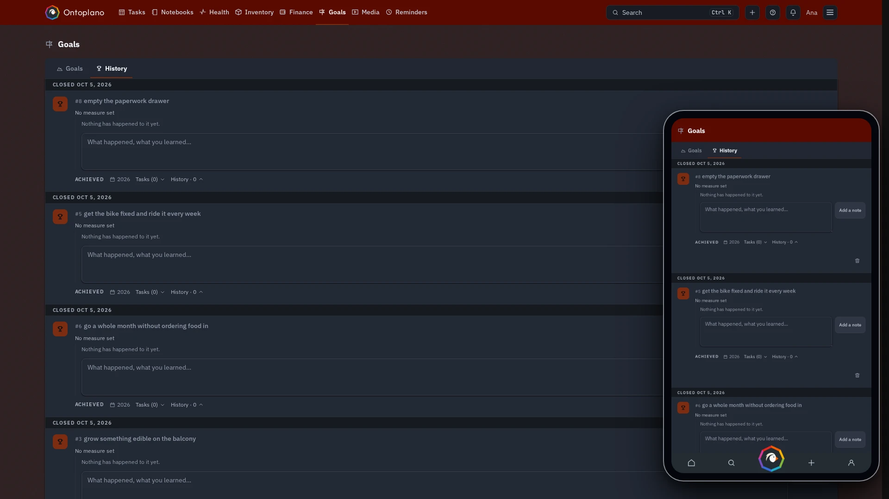

<!-- Generated with the release: edits here are overwritten. -->

# Screenshots

Every room on a desktop and on a phone. [Back to the README](../README.md).

## Home

## Tasks

### Plan

### Tasks

### Board

### Activities

### Review

## Notebooks

### Notebooks

### Diary

### Ideas

### Weekly notes

### People

### Tags

## Health

### Habits

### Workouts

### Recipes

### Sleep

### Weight

## Inventory

## Finance

### Ledgers

### Bills

### Rules

### Insights

## Goals

### Goals

### History

## Media

### Recordings

### Gallery

## Reminders

## Settings

